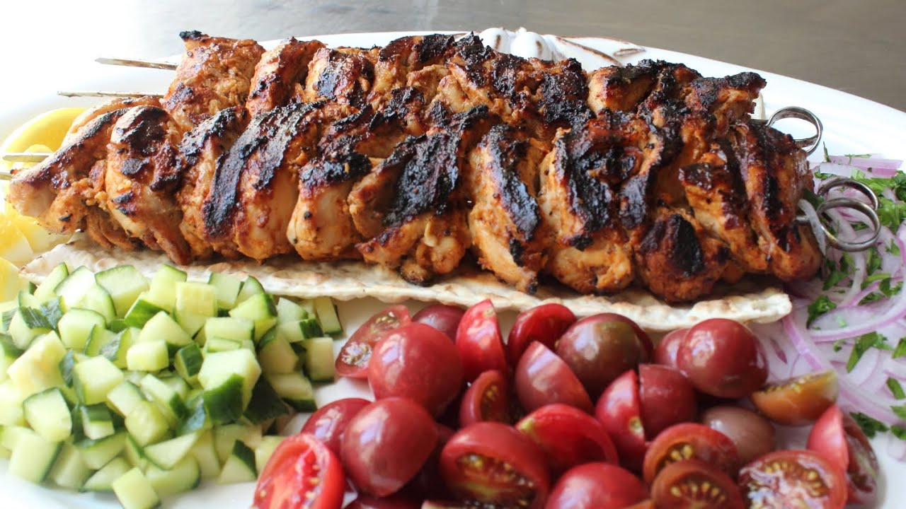

---
tags:
  - kureci
  - gril
title: Šašlík na grilu
---

**Ingredience**

- 1 cup plain whole milk Greek yogurt
- 2 tablespoons olive oil
- 2 or 3 tablespoons freshly squeezed lemon juice
- 2 tbsp ketchup
- 6 finely minced garlic cloves
- 1 tbsp kosher salt
- 1 teaspoon freshly ground black pepper
- 1 tbsp Aleppo red pepper flakes
- 1 teaspoon paprika
- 1 1/2 teaspoon cumin
- 1/8 teaspoon cinnamon
- 2 1/2 pounds boneless skinless chicken thighs
- 4 long metal skewers

**Postup**

1. Whisk yogurt, lemon juice, olive oil, ketchup, garlic, red pepper flakes, salt, cumin, black pepper, paprika, and cinnamon together in a bowl.

2. Place chicken thigh halves into the yogurt marinade and coat them thoroughly on all sides. Cover bowl with plastic wrap and refrigerate 2 to 8 hours.

3. Preheat an outdoor grill for medium-high heat and lightly oil the grate.

4. Using 2 skewers for each kebab, thread half of the chicken thighs onto each pair of skewers making a fairly thick "log" shape.

5. Place kebabs on grill. Do not try to turn them until they begin to unstick from the grill, 3 or 4 minutes. Turn kebabs and grill the other side 3 or 4 minutes; turn. Continue cooking and turning until chicken is no longer pink in the center and the juices run clear, about 6 minutes. An instant-read thermometer inserted into the center should read at least 165 degrees F (74 degrees C).

**Video**

<figure class="video_container">
 <iframe width="560" height="315" src="https://www.youtube.com/embed/LhZ-5y8eTZk" frameborder="0" allow="accelerometer; autoplay; encrypted-media; gyroscope; picture-in-picture" allowfullscreen></iframe>
</figure>
